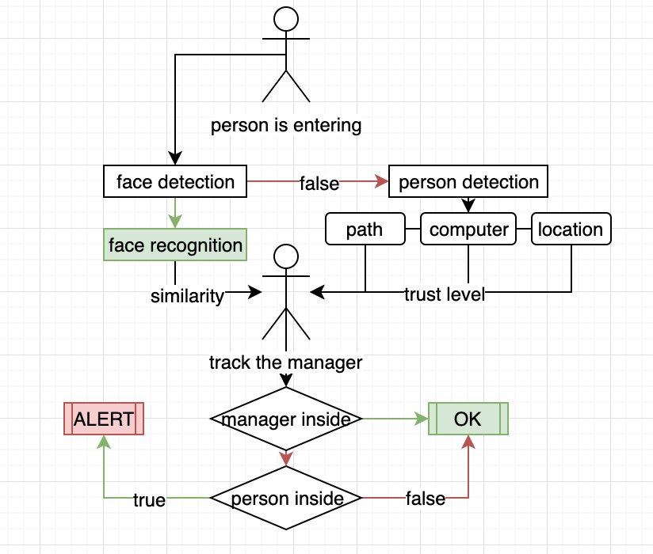

# Video processing project

The project’s purpose is to monitor a live stream of the ski rental office, process it and detect abnormal behavior, such as the absence of the responsible person at the same time as the presence of another person. And then send an alert with information via email or telegram to the administrator.

The goals in completing this project: • video processing;
* person detection;
* manager presence detection; • manager tracking;
* alert event detection;
* alert sending. 

[Demo video](https://www.youtube.com/watch?v=JV4iPwcTF_Y&ab_channel=vAD_lv)
